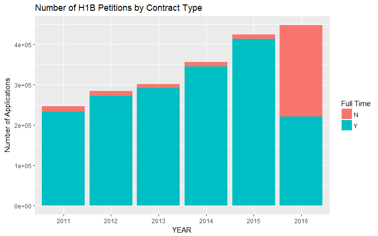

# What is H1B visa?

The H-1B is a visa in the United States under the Immigration and Nationality Act, section 101(a)(15)(H) which allows U.S. employers to employ foreign workers in specialty occupations (source: [Wikipedia]( https://en.wikipedia.org/wiki/H-1B_visa>))

This visa type is a gate to living in the United States for many dreamers, who seek a better life. My imaginary dreamer asked me if I can help him make a data driven decison of what to study to have a better chance.


# We need data!

Of course! I knew Kaggle is rich of data, so we turned to it and found data for the H1B visa applications generated by the US Department of Labor. The data can be found in [Kaggle](https://www.kaggle.com/nsharan/h-1b-visa). 

Before we begin our analysis, we need to load important libraries. Then, we read the data to a data frame named dataset_original. We'd keep this dataframe untouched in case we need to return to it and create a clone named dataset.


```r
# basic libraries
library("tidyr")
library("dplyr")
library("data.table")
library("ggplot2")
library("stringr")
library("knitr")
library("kableExtra")
library("stringdist")
library("readr")

# libraries for text clouds
library("tm")
library("SnowballC")
library("wordcloud")
library("RColorBrewer")

# reading the dataset
dataset_original = read_csv('h1b_kaggle.csv')
dataset = dataset_original

# kable format
options(knitr.table.format = "html") 
```

Let's get to know the data we're dealing with. We look at the variable names, variable types, take a glance at some observations, data dimesions, etc.

```r
glimpse(dataset)
```

```
## Observations: 3,002,458
## Variables: 11
## $ X1                 <int> 1, 2, 3, 4, 5, 6, 7, 8, 9, 10, 11, 12, 13, ...
## $ CASE_STATUS        <chr> "CERTIFIED-WITHDRAWN", "CERTIFIED-WITHDRAWN...
## $ EMPLOYER_NAME      <chr> "UNIVERSITY OF MICHIGAN", "GOODMAN NETWORKS...
## $ SOC_NAME           <chr> "BIOCHEMISTS AND BIOPHYSICISTS", "CHIEF EXE...
## $ JOB_TITLE          <chr> "POSTDOCTORAL RESEARCH FELLOW", "CHIEF OPER...
## $ FULL_TIME_POSITION <chr> "N", "Y", "Y", "Y", "Y", "Y", "Y", "Y", "Y"...
## $ PREVAILING_WAGE    <dbl> 36067.0, 242674.0, 193066.0, 220314.0, 1575...
## $ YEAR               <int> 2016, 2016, 2016, 2016, 2016, 2016, 2016, 2...
## $ WORKSITE           <chr> "ANN ARBOR, MICHIGAN", "PLANO, TEXAS", "JER...
## $ lon                <dbl> -83.74304, -96.69889, -74.07764, -104.99025...
## $ lat                <dbl> 42.28083, 33.01984, 40.72816, 39.73924, 38....
```
The data consists of 11 variables and more than 3 milions observations collected over 6 years. Among the 11 variables, there are only 3 numeric variables which are *PREVAILING_WAGE* and the location variables (i.e. *lon* and *lat*). There is a binary variable which is the *FULL_TIME_POSITION*. The rests are categorical variables. In the next section, we change the variable types accordingly, and change some of them.


# How about some cleaning? 
Examining the data, we find that it needs some **cleaning** and **tidying**:

1. The first variable is a repetition of R indixing, I'll drop it.

2. *WORKSITE* consists of cities and states, and I want to separate them to do sime analysis on the state level

3. There are some missing data in the variables, *YEAR* and *FULL_TIME_POSITION*, which are negligable compared to the number of observations we have. Thus, I'll drop these observations.

4. I'll change the type of the variables, *SOC_NAME*, *JOB_TITLE*, *CITY*, *STATE* and *YEAR* to factors, and *PREVAILING_WAGE* to numberic.

5. I'll change the letter case of variabes to ensure consistency.

```r
dataset = dataset[!names(dataset)=="X"]
dataset = separate(dataset, WORKSITE, c("CITY", "STATE"), sep = ', ', remove = TRUE)
dataset = dataset[!is.na(dataset$YEAR),] # only 13 is missing
dataset = dataset[!is.na(dataset$FULL_TIME_POSITION),] # only 2 is missing
dataset$CASE_STATUS = as.factor(dataset$CASE_STATUS)
levels(dataset$CASE_STATUS)[5] = "PENDING REVIEW" # long factor level
dataset$CITY = toupper(dataset$CITY) %>% as.factor()
dataset$YEAR = as.factor(dataset$YEAR)
dataset$SOC_NAME = tolower(dataset$SOC_NAME) %>% str_trim() %>% as.factor()
dataset$JOB_TITLE = tolower(dataset$JOB_TITLE) %>% str_trim() %>% as.factor()
dataset$EMPLOYER_NAME = tolower(dataset$EMPLOYER_NAME) %>% str_trim() %>% as.factor()
dataset$PREVAILING_WAGE = as.numeric(dataset$PREVAILING_WAGE)
# replacing the states with their abbreviations
states_abbr = read.csv("states.csv")
states.abbr = toupper(states_abbr$Abbreviation)
states.full = toupper(states_abbr$State)
match = amatch(dataset$STATE, states.full, maxDist=1)
dataset$STATE[ !is.na(match) ] = states.abbr[ na.omit( match ) ]
dataset$STATE = toupper(dataset$STATE) %>% as.factor()
```

The data show that there are 53 states, including a state named "NA", in which it has more than 3600 observations. Although it could be negligable (0.1% of the data), it is better to understand why they are missing.

**Wait a minute!**

How many states are there in the US? 

50!

52!

56!

Is Washington DC a state? How about Puerto Rico? If you're confused, it's OK, you're not alone. Although, there are 50 stars in the American flag representing the number of states, there is a federal district (i.e. Washinton DC), five other major territories and various possesions (for more details refer to [Wikipedia](https://en.wikipedia.org/wiki/United_States)). 

In fact, the "NA" data points are not missing data, they are the territories. Looing at their corresponding cities, we find that most of them are located in Guam territory. Never heard of it? See it in the [map](https://www.google.com/maps/dir/43.0062201,-89.4000342/Guam/@12.886218,140.7290401,3z/data=!4m10!4m9!1m1!4e1!1m5!1m1!1s0x671f76ff930f24ef:0x5571ae91c5b3e5a6!2m2!1d144.793731!2d13.444304!3e0). BUT, before you click the link, I want you to guess its location. Let me know in the comment if you guessed it right, or write "Now I know where Guam is!".

Anyway! For the purpose of this analysis, we consider them all states. The 50 states, Washington DC, Puerto Rico and "NA" (to be renamed OTHERS). So, we'd have 53 states. 

```r
levels(dataset$STATE)[levels(dataset$STATE) =="NA"] = "OTHERS"
```
# Let's explore the data! 

Because there are many states, we would like to check the states with the highest number of petitions.

```r
states_df = count(dataset, STATE, sort = TRUE)
x=0
for (i in 1:53){
  x[i] <- c(round(sum(states_df[1:i,2])/dim(dataset)[1], digits = 4))}
top_states_cum = bind_cols(states_df, data_frame(x))
kable(head(top_states_cum, 10), row.names=(c(1:10)), col.names = c("STATE","N","CUM"), align = 'c', booktabs = T) %>%
  kable_styling(bootstrap_options = "striped", full_width = F)
```

<table class="table table-striped" style="width: auto !important; margin-left: auto; margin-right: auto;">
 <thead>
  <tr>
   <th style="text-align:left;">   </th>
   <th style="text-align:center;"> STATE </th>
   <th style="text-align:center;"> N </th>
   <th style="text-align:center;"> CUM </th>
  </tr>
 </thead>
<tbody>
  <tr>
   <td style="text-align:left;"> 1 </td>
   <td style="text-align:center;"> CA </td>
   <td style="text-align:center;"> 559940 </td>
   <td style="text-align:center;"> 0.1865 </td>
  </tr>
  <tr>
   <td style="text-align:left;"> 2 </td>
   <td style="text-align:center;"> TX </td>
   <td style="text-align:center;"> 294454 </td>
   <td style="text-align:center;"> 0.2846 </td>
  </tr>
  <tr>
   <td style="text-align:left;"> 3 </td>
   <td style="text-align:center;"> NY </td>
   <td style="text-align:center;"> 291410 </td>
   <td style="text-align:center;"> 0.3816 </td>
  </tr>
  <tr>
   <td style="text-align:left;"> 4 </td>
   <td style="text-align:center;"> NJ </td>
   <td style="text-align:center;"> 214076 </td>
   <td style="text-align:center;"> 0.4529 </td>
  </tr>
  <tr>
   <td style="text-align:left;"> 5 </td>
   <td style="text-align:center;"> IL </td>
   <td style="text-align:center;"> 160813 </td>
   <td style="text-align:center;"> 0.5065 </td>
  </tr>
  <tr>
   <td style="text-align:left;"> 6 </td>
   <td style="text-align:center;"> MA </td>
   <td style="text-align:center;"> 116466 </td>
   <td style="text-align:center;"> 0.5453 </td>
  </tr>
  <tr>
   <td style="text-align:left;"> 7 </td>
   <td style="text-align:center;"> PA </td>
   <td style="text-align:center;"> 109959 </td>
   <td style="text-align:center;"> 0.5819 </td>
  </tr>
  <tr>
   <td style="text-align:left;"> 8 </td>
   <td style="text-align:center;"> FL </td>
   <td style="text-align:center;"> 105773 </td>
   <td style="text-align:center;"> 0.6171 </td>
  </tr>
  <tr>
   <td style="text-align:left;"> 9 </td>
   <td style="text-align:center;"> GA </td>
   <td style="text-align:center;"> 103167 </td>
   <td style="text-align:center;"> 0.6515 </td>
  </tr>
  <tr>
   <td style="text-align:left;"> 10 </td>
   <td style="text-align:center;"> WA </td>
   <td style="text-align:center;"> 102801 </td>
   <td style="text-align:center;"> 0.6857 </td>
  </tr>
</tbody>
</table>

Surprisingly, we find that a few states represent the majority of petitions. More specifcally, the top 10 states represent 68.57% of the total petitions, with California alone claiming 18.65%. 

Is that because of the silicon vally? We will see!

We subset the dataset for the top 10 states.

```r
top_state_num = 10
top_states_id <- as.vector(states_df[1:top_state_num,]$STATE)
top_states = data.frame(dataset[dataset$STATE %in% top_states_id,])
```
Now, let's see this in a graph and see whether the number of applications has been increasing or decreasing over the years.

```r
# a reordering function
reorder_fun <- function(x) {
  factor(x, levels = names(sort(table(x), decreasing = TRUE)))
}
ggplot(top_states, aes(top_states$YEAR, fill = reorder_fun(STATE))) + 
  geom_bar(position = "stack") + 
  theme(axis.text.x = element_text(angle=0)) +
  scale_fill_discrete(name="Year") +
  xlab("State") +
  ylab("Number of Applications") +
  ggtitle("Number of H1B Petitions by Year")
```


From the graph above, we see that the overall number of petitions is increaseing and California has the highest number of applications in each year.

```r
top_states_by_year = group_by(top_states, YEAR) %>% count(YEAR, STATE)

ggplot(top_states_by_year, aes(YEAR, n, color =  STATE, group = STATE)) +
  geom_line() + 
  ylab("Number of Applications") +
  ggtitle("Trend of H1B Petitions of the Top 10 States")
```


At the state level, almost all of the top states show a significant increase of petitions. California leads this increase, but it slowed down in 2016. Texas, on the other hand, shows a rapid interese over the past 6 years. New York held the second place until 2013, when exceeded by Texas. New Jersey had a sharp increase in 2014 abd 2015, but stayed steady in 2016. While Illinois's number of applications has been increasing slowly but steadly, New York showed a slight decrease in 2013 followed by a rapid increase.

Lately, we noticed that short term contracts is evolving more than ever, and we were wondering if that is also the case with the H1B visa petitions.

```r
ggplot(top_states) +
  geom_bar(aes(YEAR, fill = FULL_TIME_POSITION)) +
  scale_fill_discrete(name="Full Time") +
  ylab("Number of Applications") +
  ggtitle("Number of H1B Petitions by Contract Type")
```


Indeed, more than 50% of the applications in 2016 are for part-time positions. It seems corporations are less interested in long-term commitments. Perhabs, it could be that the employers are uncertain about immigration policy changes by the new administration and are being precautious. More percisely, from an economic perspective, part-time hiring might be a good strategy to align the companys' missions with future uncertainty. It enhances the country's mission of securing more jobs to the American people.


```r
ggplot(top_states) +
  geom_bar(aes(YEAR, fill = CASE_STATUS)) +
  scale_fill_discrete(name="Case Status") +
  ylab("Number of Applications") +
  ggtitle("Number of H1B Petitions by the Case Status")
```


The majority of the applcations have been certified with a rapid increase over the last three years. 

My imaginary dreamer is from a STEM major, so it makes sense to narrow our analysis to those areas. Therefore, we created a file for the SOC_NAME variable that lists the occupations in those areas based on the classification of [US Department of Labor](https://www.bls.gov/oes/current/oes_stru.htm#15-0000). We borrowed the occupations of Computer and Mathematical Occupations (SOC15) and Architecture and Engineering Occupations (SOC17).

```r
SOC = read_csv("SOC.csv",trim_ws = T,col_names = F)
names(SOC) = c("id", "occup","field")
# remove the whitespaces around the variables and change it to upper cases
SOC$id = str_trim(SOC$id)
SOC$occup = str_trim(SOC$occup)
SOC$occup = tolower(SOC$occup)
# split the occupations
SOC15 = SOC[SOC$field==15,]
SOC17 = SOC[SOC$field==17,]
```
Now, let's check the propotions of these jobs. 

```r
prop_stem = sum(dataset$SOC_NAME %in% SOC$occup | dataset$SOC_NAME %in% SOC$id,na.rm = TRUE)/dim(dataset)[1]

prop_CompMath = sum(dataset$SOC_NAME %in% SOC15$occup | dataset$SOC_NAME %in% SOC15$id,na.rm = TRUE)/dim(dataset)[1]
props = data.frame(prop_CompMath,(prop_stem - prop_CompMath), prop_stem )
names(props) = c("Computer & Math", "Architecture & Engineering", "STEM")
kable(round(props,4), align = 'c', booktabs = T) %>%
  kable_styling(bootstrap_options = "striped", full_width = F)
```

<table class="table table-striped" style="width: auto !important; margin-left: auto; margin-right: auto;">
 <thead>
  <tr>
   <th style="text-align:center;"> Computer &amp; Math </th>
   <th style="text-align:center;"> Architecture &amp; Engineering </th>
   <th style="text-align:center;"> STEM </th>
  </tr>
 </thead>
<tbody>
  <tr>
   <td style="text-align:center;"> 0.5835 </td>
   <td style="text-align:center;"> 0.0706 </td>
   <td style="text-align:center;"> 0.6541 </td>
  </tr>
</tbody>
</table>
Almost 2/3 of the petitions come from these two fields. 58% of the petitions are claimed by the computer and math related occupations. STEM seems the major gate for many dreamers. Let's see the jobs that have the most petitions. 

```r
# word cloud for jobs
jobs_df = count(dataset, JOB_TITLE, sort = TRUE)
wordcloud(words = jobs_df$JOB_TITLE, 
          freq = jobs_df$n, 
          min.freq = 100,
          max.words=200, 
          random.order=FALSE, 
          rot.per=0.25, 
          colors=brewer.pal(8, "Dark2")) 
```


Programmer Analyst is the most demanded job for H1B, followed by Software Engineers, Computer Programmers, System Analysts, Software Developers and Business Analysts. The following table shows the number of petitions for the top 6 jobs. We wondered if the distribution of these jobs follows the distribution of the overall petitions. For instance, would we expect California to have the highest number of applications for these high demanded jobs? 

```r
top_jobs_num = 6
top_jobs = jobs_df[1:top_jobs_num,] %>%
  droplevels() %>% 
  rename(US = n)
top_jobs_vec = as.vector(pull(top_jobs, JOB_TITLE))
# counting the petitions by jobs
top_states %>% 
  group_by(JOB_TITLE) %>%
  summarise(n=n()) %>%
  arrange(desc(n)) %>%
  head(top_jobs_num)  %>% 
  droplevels() %>% 
  rename("Top.States" = n) -> top_jobs_top_states_count
top_jop_comp = full_join(top_jobs, top_jobs_top_states_count, by = "JOB_TITLE") %>% mutate(Prop = round(Top.States/US, 4))

# function to count the number of petitions for the top 6 jobs in the top 10 states
counter = function(z){
  filter(top_states, STATE == z) %>%
  group_by(JOB_TITLE) %>%
  filter(JOB_TITLE %in% top_jobs_vec) %>%
  summarise(n=n()) 
}

# distribution of high tech jobs among the top states
for(i in 1:top_state_num){
  if(i==1){
    counter(top_states_id[i]) -> top_jobs_state
    colnames(top_jobs_state)[2] = top_states_id[i]
  } else {
    counter(top_states_id[i]) -> temp
    colnames(temp)[2] = top_states_id[i]
    top_jobs_state = left_join(top_jobs_state, temp, by = "JOB_TITLE")
  }
}
kable(top_jop_comp, align = 'c', booktabs = T) %>%
  kable_styling(bootstrap_options = "striped", full_width = F)
```

<table class="table table-striped" style="width: auto !important; margin-left: auto; margin-right: auto;">
 <thead>
  <tr>
   <th style="text-align:center;"> JOB_TITLE </th>
   <th style="text-align:center;"> US </th>
   <th style="text-align:center;"> Top.States </th>
   <th style="text-align:center;"> Prop </th>
  </tr>
 </thead>
<tbody>
  <tr>
   <td style="text-align:center;"> programmer analyst </td>
   <td style="text-align:center;"> 249042 </td>
   <td style="text-align:center;"> 170146 </td>
   <td style="text-align:center;"> 0.6832 </td>
  </tr>
  <tr>
   <td style="text-align:center;"> software engineer </td>
   <td style="text-align:center;"> 121334 </td>
   <td style="text-align:center;"> 89964 </td>
   <td style="text-align:center;"> 0.7415 </td>
  </tr>
  <tr>
   <td style="text-align:center;"> computer programmer </td>
   <td style="text-align:center;"> 70570 </td>
   <td style="text-align:center;"> 44302 </td>
   <td style="text-align:center;"> 0.6278 </td>
  </tr>
  <tr>
   <td style="text-align:center;"> systems analyst </td>
   <td style="text-align:center;"> 61971 </td>
   <td style="text-align:center;"> 42411 </td>
   <td style="text-align:center;"> 0.6844 </td>
  </tr>
  <tr>
   <td style="text-align:center;"> software developer </td>
   <td style="text-align:center;"> 42925 </td>
   <td style="text-align:center;"> 28437 </td>
   <td style="text-align:center;"> 0.6625 </td>
  </tr>
  <tr>
   <td style="text-align:center;"> business analyst </td>
   <td style="text-align:center;"> 39683 </td>
   <td style="text-align:center;"> 26847 </td>
   <td style="text-align:center;"> 0.6765 </td>
  </tr>
</tbody>
</table>

```r
top_jobs_state[,top_state_num+2] = rowSums(top_jobs_state[,-1]) 
names(top_jobs_state)[top_state_num+2] = "SUM"
top_jobs_state %>%
  arrange(desc(SUM)) -> top_jobs_state
kable(top_jobs_state, align = 'c', booktabs = T) %>%
  kable_styling(bootstrap_options = "striped", full_width = F)
```

<table class="table table-striped" style="width: auto !important; margin-left: auto; margin-right: auto;">
 <thead>
  <tr>
   <th style="text-align:center;"> JOB_TITLE </th>
   <th style="text-align:center;"> CA </th>
   <th style="text-align:center;"> TX </th>
   <th style="text-align:center;"> NY </th>
   <th style="text-align:center;"> NJ </th>
   <th style="text-align:center;"> IL </th>
   <th style="text-align:center;"> MA </th>
   <th style="text-align:center;"> PA </th>
   <th style="text-align:center;"> FL </th>
   <th style="text-align:center;"> GA </th>
   <th style="text-align:center;"> WA </th>
   <th style="text-align:center;"> SUM </th>
  </tr>
 </thead>
<tbody>
  <tr>
   <td style="text-align:center;"> programmer analyst </td>
   <td style="text-align:center;"> 32251 </td>
   <td style="text-align:center;"> 27397 </td>
   <td style="text-align:center;"> 14117 </td>
   <td style="text-align:center;"> 36189 </td>
   <td style="text-align:center;"> 15819 </td>
   <td style="text-align:center;"> 7319 </td>
   <td style="text-align:center;"> 14545 </td>
   <td style="text-align:center;"> 8515 </td>
   <td style="text-align:center;"> 9586 </td>
   <td style="text-align:center;"> 4408 </td>
   <td style="text-align:center;"> 170146 </td>
  </tr>
  <tr>
   <td style="text-align:center;"> software engineer </td>
   <td style="text-align:center;"> 42153 </td>
   <td style="text-align:center;"> 9484 </td>
   <td style="text-align:center;"> 6442 </td>
   <td style="text-align:center;"> 6148 </td>
   <td style="text-align:center;"> 5325 </td>
   <td style="text-align:center;"> 4395 </td>
   <td style="text-align:center;"> 2849 </td>
   <td style="text-align:center;"> 2993 </td>
   <td style="text-align:center;"> 4036 </td>
   <td style="text-align:center;"> 6139 </td>
   <td style="text-align:center;"> 89964 </td>
  </tr>
  <tr>
   <td style="text-align:center;"> computer programmer </td>
   <td style="text-align:center;"> 7889 </td>
   <td style="text-align:center;"> 7586 </td>
   <td style="text-align:center;"> 3442 </td>
   <td style="text-align:center;"> 7344 </td>
   <td style="text-align:center;"> 5006 </td>
   <td style="text-align:center;"> 2524 </td>
   <td style="text-align:center;"> 3105 </td>
   <td style="text-align:center;"> 3174 </td>
   <td style="text-align:center;"> 3555 </td>
   <td style="text-align:center;"> 677 </td>
   <td style="text-align:center;"> 44302 </td>
  </tr>
  <tr>
   <td style="text-align:center;"> systems analyst </td>
   <td style="text-align:center;"> 10115 </td>
   <td style="text-align:center;"> 9730 </td>
   <td style="text-align:center;"> 2964 </td>
   <td style="text-align:center;"> 4646 </td>
   <td style="text-align:center;"> 3896 </td>
   <td style="text-align:center;"> 1221 </td>
   <td style="text-align:center;"> 2438 </td>
   <td style="text-align:center;"> 2080 </td>
   <td style="text-align:center;"> 3670 </td>
   <td style="text-align:center;"> 1651 </td>
   <td style="text-align:center;"> 42411 </td>
  </tr>
  <tr>
   <td style="text-align:center;"> software developer </td>
   <td style="text-align:center;"> 6131 </td>
   <td style="text-align:center;"> 4970 </td>
   <td style="text-align:center;"> 2913 </td>
   <td style="text-align:center;"> 4263 </td>
   <td style="text-align:center;"> 2631 </td>
   <td style="text-align:center;"> 1272 </td>
   <td style="text-align:center;"> 1452 </td>
   <td style="text-align:center;"> 1572 </td>
   <td style="text-align:center;"> 2379 </td>
   <td style="text-align:center;"> 854 </td>
   <td style="text-align:center;"> 28437 </td>
  </tr>
  <tr>
   <td style="text-align:center;"> business analyst </td>
   <td style="text-align:center;"> 5107 </td>
   <td style="text-align:center;"> 3715 </td>
   <td style="text-align:center;"> 3784 </td>
   <td style="text-align:center;"> 5725 </td>
   <td style="text-align:center;"> 2261 </td>
   <td style="text-align:center;"> 1448 </td>
   <td style="text-align:center;"> 1532 </td>
   <td style="text-align:center;"> 1340 </td>
   <td style="text-align:center;"> 1360 </td>
   <td style="text-align:center;"> 575 </td>
   <td style="text-align:center;"> 26847 </td>
  </tr>
</tbody>
</table>

The tables above show that the top states account for about 2/3 of the top jobs. Software Engineers in the top states account for 74% of the total petitions. At the state level, 47% of this job title is entitled for California. What surprising is that New Jersey is the highest recruiter of Programmer Analysts with 21% beating California. 

```r
CA = top_states %>% filter(STATE == "CA") %>% group_by(CITY) %>% count(CITY) %>% arrange(desc(n))
kable(head(CA,10), align = 'c', booktabs = T) %>%
  kable_styling(bootstrap_options = "striped", full_width = F)
```

<table class="table table-striped" style="width: auto !important; margin-left: auto; margin-right: auto;">
 <thead>
  <tr>
   <th style="text-align:center;"> CITY </th>
   <th style="text-align:center;"> n </th>
  </tr>
 </thead>
<tbody>
  <tr>
   <td style="text-align:center;"> SAN FRANCISCO </td>
   <td style="text-align:center;"> 62787 </td>
  </tr>
  <tr>
   <td style="text-align:center;"> SAN JOSE </td>
   <td style="text-align:center;"> 50083 </td>
  </tr>
  <tr>
   <td style="text-align:center;"> SUNNYVALE </td>
   <td style="text-align:center;"> 35136 </td>
  </tr>
  <tr>
   <td style="text-align:center;"> MOUNTAIN VIEW </td>
   <td style="text-align:center;"> 29479 </td>
  </tr>
  <tr>
   <td style="text-align:center;"> SAN DIEGO </td>
   <td style="text-align:center;"> 28881 </td>
  </tr>
  <tr>
   <td style="text-align:center;"> SANTA CLARA </td>
   <td style="text-align:center;"> 28167 </td>
  </tr>
  <tr>
   <td style="text-align:center;"> LOS ANGELES </td>
   <td style="text-align:center;"> 26517 </td>
  </tr>
  <tr>
   <td style="text-align:center;"> IRVINE </td>
   <td style="text-align:center;"> 17052 </td>
  </tr>
  <tr>
   <td style="text-align:center;"> PALO ALTO </td>
   <td style="text-align:center;"> 16686 </td>
  </tr>
  <tr>
   <td style="text-align:center;"> FREMONT </td>
   <td style="text-align:center;"> 14359 </td>
  </tr>
</tbody>
</table>
The above table shows the top 10 H1B sponsoring cities of California. Seven cities of the list are located in the Silicon Valley. Thus, this confirms our speculation that most of the hires come from the high tech companies.

```r
NJ = top_states %>% filter(STATE == "NJ" & JOB_TITLE %in% top_jobs_vec) %>% group_by(YEAR) %>% count(YEAR, JOB_TITLE)
ggplot(NJ, aes(YEAR, n, color = JOB_TITLE, group =JOB_TITLE)) +
  geom_line() + 
  ylab("Number of Applications") +
  ggtitle("Trends of New Jersey's H1B Petitions by the Top Job Titles")
```


Since New Jersey stood out for some of the jobs, we want see the trends of the top jobs over the years. The trends of the top jobs in New Jersey is shown above. The Programmer Analyst job skyrocketed in 2014 and 2015. In 2016, the demand for this position has slightly decreased.
The following word cloud shows the employers with the most petitions.


```r
# word cloud for employers
employer_df = count(dataset, EMPLOYER_NAME, sort = TRUE)

wordcloud(words = employer_df$EMPLOYER_NAME, 
          freq = jobs_df$n, 
          min.freq = 100,
          max.words=200, 
          random.order=FALSE, 
          rot.per=0.25, 
          colors=brewer.pal(8, "Set1")) 
```


```r
kable(head(employer_df), booktabs = T)%>%
  kable_styling(bootstrap_options = "striped", full_width = F)
```

<table class="table table-striped" style="width: auto !important; margin-left: auto; margin-right: auto;">
 <thead>
  <tr>
   <th style="text-align:left;"> EMPLOYER_NAME </th>
   <th style="text-align:right;"> n </th>
  </tr>
 </thead>
<tbody>
  <tr>
   <td style="text-align:left;"> infosys limited </td>
   <td style="text-align:right;"> 130592 </td>
  </tr>
  <tr>
   <td style="text-align:left;"> tata consultancy services limited </td>
   <td style="text-align:right;"> 64726 </td>
  </tr>
  <tr>
   <td style="text-align:left;"> wipro limited </td>
   <td style="text-align:right;"> 48117 </td>
  </tr>
  <tr>
   <td style="text-align:left;"> deloitte consulting llp </td>
   <td style="text-align:right;"> 36742 </td>
  </tr>
  <tr>
   <td style="text-align:left;"> ibm india private limited </td>
   <td style="text-align:right;"> 34219 </td>
  </tr>
  <tr>
   <td style="text-align:left;"> accenture llp </td>
   <td style="text-align:right;"> 33447 </td>
  </tr>
</tbody>
</table>
Data related jobs were not in high demand. Perhabs, that is because data science is a multidisciplinary job. A lot of data scientists data engineers are originally programmers or statisticians. Maybe that would change in 2017's petitions! Maybe.


```r
# data related jobs
data = c("DATA","ANALYTICS","STATISTICIAN","MATH") %>% tolower()
data_jobs = dataset[dataset$JOB_TITLE %like% data,]
data_jobs_tbl = count(data_jobs, JOB_TITLE, sort = TRUE) 
top_data_job = as.vector(data_jobs_tbl[1:top_state_num,]$JOB_TITLE)
data_jobs = data_jobs[data_jobs$JOB_TITLE==top_data_job,]
  
ggplot(data_jobs) +
  geom_bar(aes(YEAR, fill = data_jobs$JOB_TITLE)) +
  scale_fill_discrete(name="JOB_TITLE") +
  ggtitle("Number of H1B Petitions for Data Related Jobs by Year")
```


**Money, money, money!**

Income is a major factor in our daily lives. Thus, we'd like to know how much these positions make. The figures below show the wage trends of the top 6 jobs in the top 10 states. It's surprising that the top paying state is not California, but Washington. It's also sharply increasing over the last two years for the top 3 jobs. It would not be as surprising when we know that the top hiring companies in Washington are Microsoft and Amazon. 


```r
top_jobs_wage_fun = function(x,y){
    dataset %>% filter(STATE==x & JOB_TITLE == y) %>%
    group_by(YEAR) %>% 
    summarise(median(PREVAILING_WAGE, na.rm = T)) -> wage
  return(wage)}

top_jobs_wage = list()
temp = data.frame()
for(j in 1:top_jobs_num){
  for(i in 1:top_state_num){
    if(i==1){
      top_jobs_wage_fun(top_states_id[i],top_jobs_vec[j]) -> temp
 }
    else {
        left_join(temp,
                  top_jobs_wage_fun(top_states_id[i],top_jobs_vec[j]),
                  by = "YEAR") -> temp}}
    names(temp) = c("YEAR", top_states_id)
    temp -> top_jobs_wage[[j]]}
names(top_jobs_wage) = top_jobs_vec

# Wage trends
for(i in 1:top_jobs_num){
  wg = gather(top_jobs_wage[[i]], key = STATE, value = Avg.Wage, -YEAR)
  plt  <-  ggplot(wg, aes(YEAR, Avg.Wage, color = STATE, group =STATE)) +
    geom_line() + 
    ylab("Average Salary") +
    ggtitle(paste("Prevailing wage of", top_jobs_vec[i]))
  print(plt)}
```


# Final thoughts!

Well, my advice to my imaginary friend, the dreamer, is to major in computer/software programming. Most of the jobs in high tech companies especially in the Silicon Valley. When it comes to which state to go to, California hires the most, but Washington pays the most. Whashington pays considerably higher for Programmer Analysts and Computer Programmers, but they are neck on neck on paying Software Engineers. New Jersey is a good candidate as they hire Programmer Analysts a little bit more than California. Data science is on the rise, but cannot compete with the programming jobs. As mentioned earlier, data science is a broad and multidisciplinary area and Data Scientists mostly come from programming backgrounds. Maybe this would change in 2017 statistics, who knows!.


**Thanks to [Sharan Naribole](https://www.kaggle.com/nsharan) for the data, it was a lot of fun.** 


**Feel free to contact, connect, communicate, converse and/or comment!**

**Nabeel Hamoud: [LinkedIn](https://www.linkedin.com/in/nmhamoud/)**
